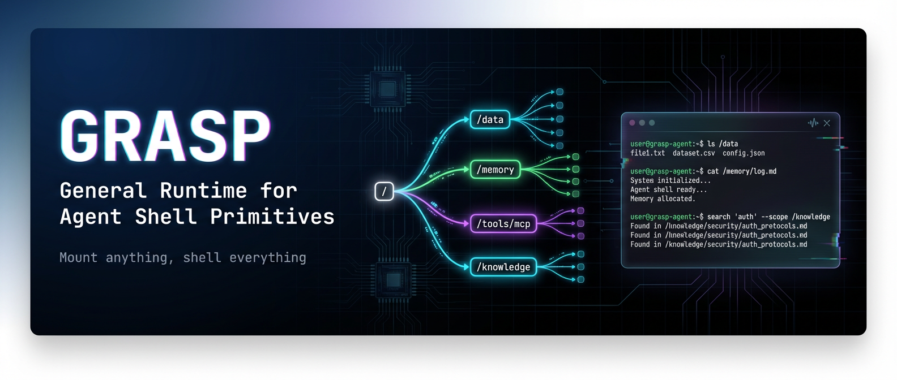

# GRASP




**Mount anything, shell everything.** A virtual userland that unifies heterogeneous data sources — files, databases, APIs, memory, tools — into one filesystem namespace. Agents `ls`, `cat`, `grep`, and pipe their way through the world.

```
/
├── data/        → LocalFS (host directory)
├── memory/      → MemFS (in-memory storage)
├── tools/mcp/   → MCPToolProvider (external tools)
├── knowledge/   → your custom provider
└── proc/        → ProcProvider (system info)
```

## Philosophy

- **One verb to access everything.** `read` works on local files, databases, APIs, and memory — the agent doesn't care what's behind the mount point.
- **Not restricting — reframing.** GRASP doesn't take capabilities away from agents. It gives them a better interface. Linux "restricts" programs from touching hardware directly — and makes them more powerful for it.
- **LLMs speak filesystem natively.** Training data is saturated with `ls`, `cat`, `grep`, `echo`. File operations are the one interface every LLM already understands. Meet them where they are.
- **Mount what matters, hide what doesn't.** An agent that sees the entire OS gets lost. An agent that sees `/workspace`, `/memory`, `/tools` knows exactly what to do. Mounting is attention management.
- **Same agent, different world.** Swap mount tables, not code. Dev, CI, sandbox, remote — the agent logic never changes.
- **Safety is a side effect of good design.** Capability-based access control and mount isolation aren't the selling point — they're a natural consequence of the abstraction.
- **The composable middle layer.** Not a framework (above), not a storage engine (below). The runtime between them that makes everything interoperable.

## Why

Agent frameworks give LLMs tools through JSON schemas — `read_file`, `write_file`, `search_files`, one API per operation. This works, but it fragments: tools don't compose, data sources have separate interfaces, and every new source means new schemas.

Unix solved this 50 years ago: **everything is a file.** Mount a data source, then use standard commands to operate on it. GRASP brings this to agents — one shell tool replaces dozens of individual tool definitions.

```bash
# One tool call, not five
cat /data/logs/2026-02-*.md | grep ERROR | head -10
```

### Comparison

The AI agent infrastructure space is growing fast. Here's where GRASP sits:

| Project | What it is | GRASP difference |
|---------|-----------|----------------------|
| **OpenClaw** | Full agent runtime (TS, 182K stars). Gives agents shell, browser, filesystem via built-in tools. | OpenClaw is a complete agent; GRASP is an embeddable layer. OpenClaw's tools are hardcoded to the host OS — GRASP virtualizes and composes across mount points. Can serve as OpenClaw's MCP backend. |
| **Turso AgentFS** | SQLite-backed agent filesystem (Rust). Copy-on-write isolation, audit logging, single-file snapshots. | AgentFS isolates file access; GRASP unifies heterogeneous sources. AgentFS has no shell, no pipes, no mount composition. Complementary — dbfs could wrap AgentFS. |
| **OpenViking** | Context database (Python, ByteDance). `viking://` protocol, L0/L1/L2 tiered loading, semantic retrieval. | OpenViking is a storage backend with vector search; GRASP is a runtime with shell. Not competitors — OpenViking can be mounted as a GRASP provider, combining semantic retrieval with shell composability. |
| **ToolFS** | FUSE-based VFS for agents (Go, IceWhaleTech). Unified `/toolfs` namespace, WASM skills, RAG. | Both are Go VFS projects. ToolFS requires FUSE (kernel module); GRASP is pure userspace with protocol-native access (MCP, 9P). ToolFS bundles RAG/skills; GRASP keeps the core minimal and mounts them as providers. |
| **AIOS** | LLM OS kernel (Python, academic). Agent scheduling, context switching, memory management. | AIOS is a research OS that manages multiple agents; GRASP is a practical runtime for individual agents. AIOS handles scheduling and resource allocation — concerns GRASP intentionally leaves to the host. |
| **Agent OS** | Self-evolving agent runtime (Rust). AIR typed control plane, capability security, constitutional self-modification. | Agent OS focuses on agent self-modification and governance; GRASP focuses on data access and tool composition. Different layers — Agent OS could use GRASP as its filesystem substrate. |
| **MCP FS Server** | Exposes host files as MCP tools (Go/TS). `read_file`, `write_file`, `search_files`. | Flat tool list for one directory. GRASP virtualizes: mount multiple sources, compose via shell pipes, search across mounts. One `shell` tool replaces the entire tool list. |

**TL;DR:** Most projects are either full agent runtimes (OpenClaw, AIOS) or single-purpose storage (AgentFS, OpenViking). GRASP is the **composable middle layer** — a virtual userland that any agent can embed, mount anything into, and operate through a shell. Think Docker for agent context: it doesn't replace your app, it gives it a portable, composable runtime.

## Install

```bash
go get github.com/jackfish212/grasp@latest
```

Requires Go 1.24+. The only external dependency is `modernc.org/sqlite` (pure Go, no CGO).

## Quick Start

```go
package main

import (
    "context"
    "fmt"

    "github.com/jackfish212/grasp"
    "github.com/jackfish212/grasp/builtins"
    "github.com/jackfish212/grasp/mounts"
)

func main() {
    v := grasp.New()
    rootFS, _ := grasp.Configure(v)
    builtins.RegisterBuiltinsOnFS(v, rootFS)

    v.Mount("/data", mounts.NewLocalFS(".", grasp.PermRW))

    sh := v.Shell("agent")
    ctx := context.Background()

    result := sh.Execute(ctx, "ls /data")
    fmt.Print(result.Output)
}
```

## Core Concepts

### Mount anything

Every data source implements the `Provider` interface (just `Stat` + `List`) and gets mounted at a path. Additional capabilities are expressed as optional interfaces, detected at runtime via type assertions:

| Interface | Methods | Purpose |
|-----------|---------|---------|
| `Provider` | `Stat`, `List` | Navigation (required) |
| `Readable` | `Open` | Read file content |
| `Writable` | `Write` | Create/update files |
| `Executable` | `Exec` | Run tools & commands |
| `Searchable` | `Search` | Full-text or semantic search |
| `Mutable` | `Mkdir`, `Remove`, `Rename` | Namespace changes |

Providers only implement what they support — no stub methods, no unused interfaces.

### Built-in providers

| Provider | Capabilities | Description |
|----------|-------------|-------------|
| `MemFS` | R/W/X/Mut | In-memory filesystem; register Go functions as commands |
| `LocalFS` | R/W/S/Mut | Mount a host directory |
| `MCPToolProvider` | R/X/S | Bridge MCP server tools as executable entries |
| `MCPResourceProvider` | R/S | Bridge MCP server resources as readable entries |
| `VikingProvider` | R/W/S/Mut | Bridge [OpenViking](https://github.com/volcengine/OpenViking) context database with L0/L1/L2 tiered loading |

### Shell everything

Agents interact through a shell with pipes, redirects, logical operators, here-documents, and environment variables:

```bash
ls /data                              # browse
cat /data/config.yaml                 # read
echo "done" > /memory/log.md          # write (redirect)
search "auth" --scope /knowledge      # cross-mount search
cat /data/users.json | grep admin     # pipes
mkdir /tmp/work && cd /tmp/work       # logical operators
cat << EOF | write /memory/note.md    # here-documents
Meeting notes from today.
EOF
```

**Built-in commands:** `ls`, `cat`, `read`, `write`, `stat`, `search`, `grep`, `find`, `head`, `tail`, `mkdir`, `rm`, `mv`, `which`, `mount`, `uname`

**Shell builtins:** `cd`, `pwd`, `echo`, `env`, `history`

### Custom providers

Implement `Provider` + whichever capability interfaces fit your data source:

```go
type WikiProvider struct{ /* ... */ }

func (w *WikiProvider) Stat(ctx context.Context, path string) (*grasp.Entry, error) { /* ... */ }
func (w *WikiProvider) List(ctx context.Context, path string, opts grasp.ListOpts) ([]grasp.Entry, error) { /* ... */ }
func (w *WikiProvider) Open(ctx context.Context, path string) (grasp.File, error) { /* ... */ }
func (w *WikiProvider) Search(ctx context.Context, q string, opts grasp.SearchOpts) ([]grasp.SearchResult, error) { /* ... */ }

v.Mount("/wiki", &WikiProvider{})
// Now: cat /wiki/Go_(programming_language) | head -20
```

### Custom commands

Register Go functions as executable commands on any MemFS:

```go
rootFS.AddExecFunc("usr/bin/greet", func(ctx context.Context, args []string, stdin io.Reader) (io.ReadCloser, error) {
    name := "world"
    if len(args) > 0 {
        name = args[0]
    }
    return io.NopCloser(strings.NewReader("Hello, " + name + "!\n")), nil
}, mounts.FuncMeta{Description: "Greet someone", Usage: "greet [name]"})
```

## Integration

GRASP is not an agent framework — it's the runtime layer underneath. Expose the same `VirtualOS` instance through multiple protocols:

| Protocol | Use case | Status |
|----------|----------|--------|
| **Go SDK** | Embed directly in Go agent code | Available |
| **MCP Server** | Connect to Claude Desktop, Cursor, or any MCP client | Available |
| **9P Server** | Cross-language POSIX access — `mount -t 9p` then use standard file I/O from Python, Rust, etc. | Planned |

### As an MCP server

Install and run:

```bash
go install github.com/jackfish212/grasp/cmd/grasp-server@latest

grasp-server --mount /data:./workspace --mount /memory:memfs
```

Configure in Claude Desktop (`claude_desktop_config.json`) or any MCP client:

```json
{
  "mcpServers": {
    "grasp": {
      "command": "grasp-server",
      "args": ["--mount", "/data:./workspace", "--mount", "/memory:memfs"]
    }
  }
}
```

The agent gets a single `shell` tool — one tool replaces dozens:

```
shell("cat /data/src/main.go | grep TODO")
shell("ls /data && search 'authentication' --scope /data --max 5")
shell("echo 'task done' >> /memory/log.md")
```

Mount sources:
- `--mount /path:./dir` — host directory (LocalFS)
- `--mount /path:memfs` — in-memory (MemFS)

### With OpenViking

Mount [OpenViking](https://github.com/volcengine/OpenViking) as a provider to combine semantic retrieval with the shell interface:

```go
import "github.com/jackfish212/grasp/mounts"

client := mounts.NewVikingClient("http://localhost:1933", "your-api-key")
v.Mount("/ctx", mounts.NewVikingProvider(client, ""))
```

```bash
ls /ctx/resources/                        # browse context tree
cat /ctx/resources/project/.abstract      # L0: ~100 tokens summary
cat /ctx/resources/project/.overview      # L1: ~2K tokens overview
cat /ctx/resources/project/docs/api.md    # L2: full content
search "auth flow" --scope /ctx           # directory-recursive semantic search
echo "https://example.com/doc.md" > /ctx/resources/new_doc  # add resource
```

## Project Structure

```
grasp/
├── vos.go              # VirtualOS — central orchestrator
├── mount_table.go      # Path → Provider resolution (longest-prefix matching)
├── configure.go        # Standard filesystem layout (/bin, /etc, /proc, ...)
├── exports.go          # Public API re-exports
├── types/              # Core interfaces: Provider, Entry, File, Perm, ...
├── mounts/             # Built-in providers: MemFS, LocalFS, MCP
├── builtins/           # Commands: ls, cat, grep, search, find, ...
├── shell/              # Shell: pipes, redirects, env, history, profile
├── mcpserver/          # MCP server: expose VirtualOS as MCP tools over stdio
├── cmd/grasp-server/   # Standalone MCP server binary
├── docs/               # Documentation
└── examples/           # Example applications
```

## Examples

The [`examples/`](examples/) directory contains complete working examples demonstrating GRASP's capabilities:

| Example | Description | Key Features |
|---------|-------------|--------------|
| **[agent-monitor](examples/agent-monitor/)** | AI agent monitors user shell activity and offers contextual help when commands fail or files change | `VOS.Watch()` for file change notifications, `Shell.OnExec()` for command hooks, event-driven agent responses |
| **[multi-agent](examples/multi-agent/)** | Three agents (Explorer → Architect → Reporter) collaborate through shared filesystem to analyze a codebase | Multi-agent coordination via files, isolated shells with shared mounts, pipeline architecture |
| **[cached-feeds](examples/cached-feeds/)** | Demonstrates union mount caching with dbfs over httpfs, showing latency improvements and offline resilience | Union mount composition, cache TTL, performance comparison |
| **[custom-mount](examples/custom-mount/)** | Build a custom provider that bridges external data sources into the VFS | Provider interface implementation, capability-based design |
| **[full-demo](examples/full-demo/)** | Comprehensive demo showing multiple providers, MCP integration, and shell operations | End-to-end integration example |
| **[github-mcp](examples/github-mcp/)** | Mount GitHub as an MCP tool provider, exposing repository operations as executable commands | MCP tool bridging, external API integration |
| **[anthropic](examples/anthropic/)** | Integrate Anthropic's Claude API with GRASP's shell interface | LLM integration, tool use patterns |

Each example includes inline documentation and can be run with `go run ./examples/<name>`.

## Documentation

See [`docs/`](docs/README.md) for full documentation:

- **[Why GRASP](docs/explanation/why-grasp.md)** — Problem statement, naming rationale, positioning, comparisons
- **[Architecture](docs/explanation/architecture.md)** — VirtualOS, MountTable, Shell internals
- **[Provider Model](docs/explanation/provider-model.md)** — Capability-based interface design
- **[Shell as Interface](docs/explanation/shell-as-interface.md)** — Why shell beats tool APIs for agents
- **[Integration Strategy](docs/explanation/integration-strategy.md)** — MCP, 9P, OpenViking
- **[Getting Started](docs/tutorials/getting-started.md)** — Step-by-step tutorial
- **[Create a Provider](docs/how-to/create-provider.md)** — Build your own data source
- **[Interface Reference](docs/reference/interfaces.md)** — Complete API reference

## License

MIT
